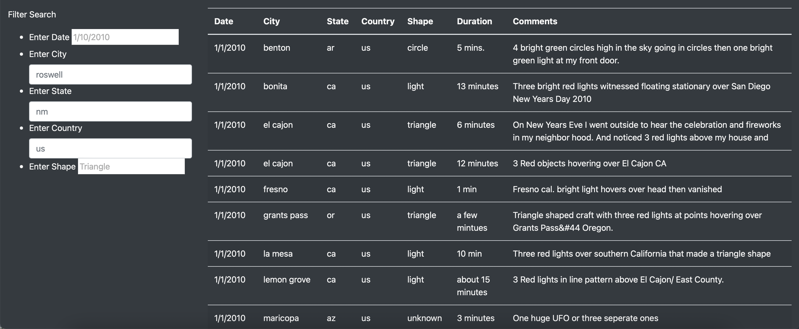
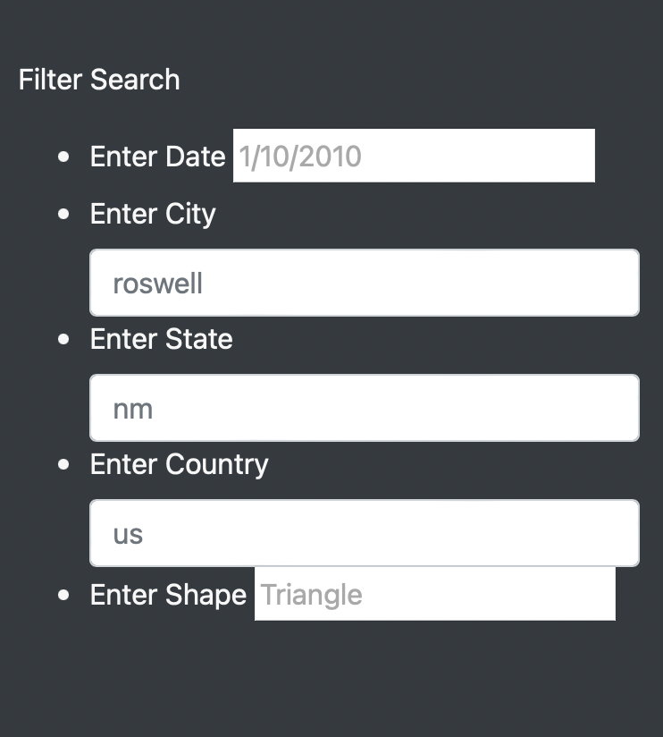
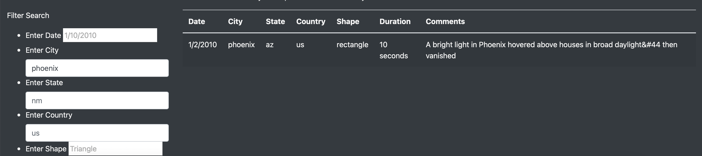
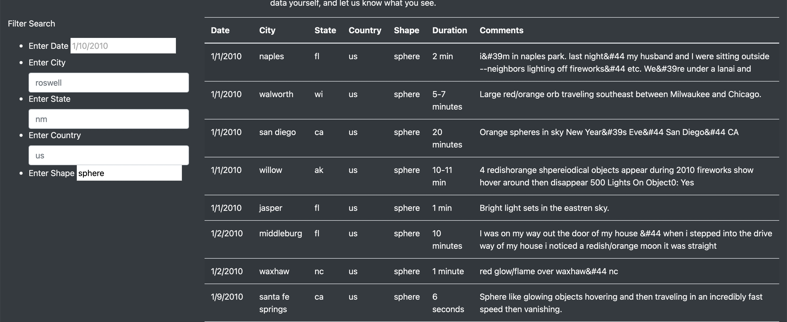

## UFOs

# Overview
The purpose of this repo is to host files allowing users to research UFO sightings based on location or date.

# Results
Specifically, users can input city, state, and country filters, plus a date range, to narrow in on a specific sighting. This tool can also be used to research the history of UFO sightings in a given area, and to track changes over time.

For example, let's say one wants to see if there have been any sightings of UFOs in Phoenix, AZ. One would first load the site:

Then, inside the filter box on the left we can narrow down the results. 

Let's add "phoenix" as a city and see our results.

Additionally, there is an option to filter by shape of the UFO, which would also allow for a user to see if there were multiple sightings of what was possibly the same object in a given period of time. For example, let's see if any spheres have been sighted.

# Summary

One drawback to this page is that the underlying dataset does not dynamically update. A future implementation would be to incorporate a web scraping system to allow for the site to update on a daily or weekly basis from known good sources of this information.

Additionally, it would be great to add additional tags to the data, like additional descriptors (lights? movement?).
